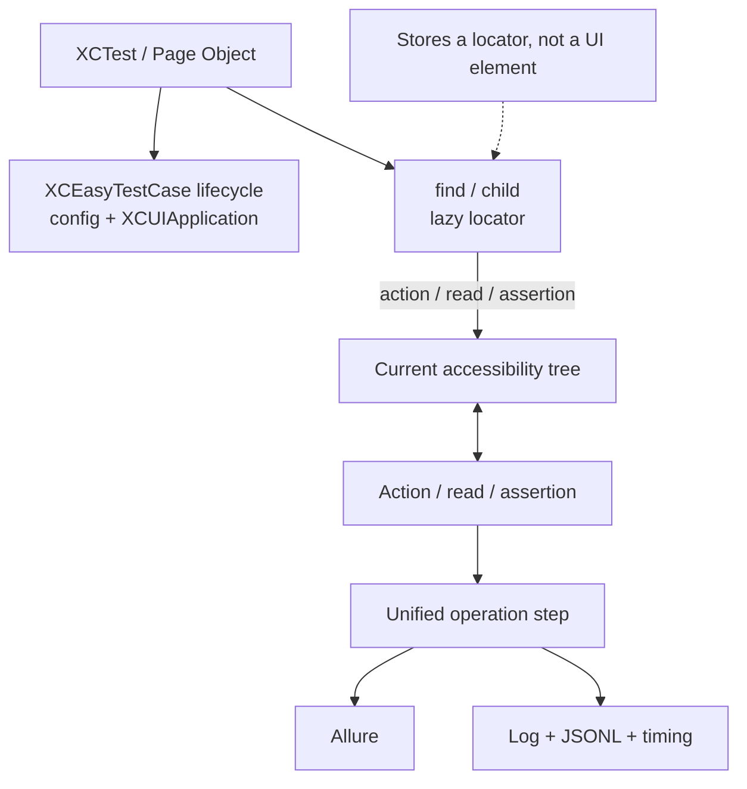

# XCEasy

[Русская версия](README_RU.md)

XCEasy is an XCTest-based framework for UI testing of iOS applications. It simplifies test code, creates Allure steps automatically, and stores logs and diagnostic artifacts designed for both people and AI tooling.

This README is a concise entry point: every section contains one basic scenario. All API variants, settings, limitations, and extended examples live in the [complete user guide](docs/en/PRODUCT_GUIDE_EN.md).

## Table of contents

- [Why XCEasy exists](#why-xceasy-exists)
- [Architecture](#architecture)
- [Requirements and installation](#requirements-and-installation)
- [Quick start](#quick-start)
- [Configuration](#configuration)
- [Test and application lifecycle](#test-and-application-lifecycle)
- [Finding and using elements](#finding-and-using-elements)
- [Element assertions](#element-assertions)
- [Value assertions](#value-assertions)
- [Soft assertions](#soft-assertions)
- [Page Object components](#page-object-components)
- [Launch arguments and environment](#launch-arguments-and-environment)
- [Given/When/Then](#givenwhenthen)
- [Deep links](#deep-links)
- [Device interaction](#device-interaction)
- [Working with API requests](#working-with-api-requests)
- [Allure](#allure)
- [Logs, diagnostics, and performance](#logs-diagnostics-and-performance)
- [Verifying the repository itself](#verifying-the-repository-itself)
- [Additional documentation](#additional-documentation)

## Why XCEasy exists

XCEasy provides one style for UIKit and SwiftUI tests: lazy element lookup, automatic waits, Page Object components, localized steps, Allure, and isolated artifacts for each test. Structured events support diagnosis and AI-assisted self-healing.

## Architecture

XCEasy connects the XCTest lifecycle, lazy UI locators, and one reporting pipeline. `find` and `child` retain only lookup instructions. An action, read, or assertion resolves a fresh `XCUIElement` against the current accessibility tree. Each execution owns its configuration, application, steps, and artifacts.



Primary repository layers:

- `XCEasy/Sources/Public` and `TestStructure` — consumer Swift API, lifecycle, and lazy elements;
- `XCEasy/Sources/Allure`, `Utils/Diagnostics`, `Utils/Performance`, and `TestStructure/XCEasyTestLogger.swift` — the unified step/artifact pipeline;
- `XCEasy/Sources/Execution` — execution isolation and machine-readable contracts;
- `XCEasy/Tests` and `XCEasyIntegrationFixture` — unit and internal UIKit/SwiftUI integration coverage;
- `docs/{ru,en}/spec` and `schemas` — versioned requirements and machine contracts.

Two independent public applications and their UI tests live in [`xceasy-examples`](https://github.com/qa-point/xceasy-examples): `UIKitExample` and `SwiftUIExample`. Multi-simulator orchestration, marker selection, sharding, recovery, and run-level aggregation belong to the independent [`xceasy-runner`](https://github.com/qa-point/xceasy-runner) product and are not part of the XCEasy Swift API.

## Requirements and installation

The package manifest's technical minimum is Xcode 15.0, Swift 5.9, and iOS 15. It follows from `swift-tools-version: 5.9` and the package deployment target. Xcode 14 and Swift 5.8 cannot load the manifest. The currently supported and verified toolchain matrix is Xcode 26.6 and Swift 6.3.3 in Swift 5 language mode. Xcode 15–26.5 may build the package, but compatibility is not guaranteed until those versions join the CI matrix.

In Xcode, use **File → Add Package Dependencies**, enter `https://github.com/qa-point/xceasy.git`, and add the `XCEasy` product to the UI-test target. The equivalent `Package.swift` dependency is:

```swift
dependencies: [
    .package(
        url: "https://github.com/qa-point/xceasy.git",
        from: "0.1.1"
    )
]
```

Observer bootstrap is included in the package and needs no manual registration. Keep the deployment target required by the application; iOS 15 is specifically the XCEasy minimum.

## Quick start

```swift
import XCTest
import XCEasy

final class LoginTests: XCEasyTestCase {
    override func configuration() {
        XCEasyConfig.apply(
            localization: .en
        )
        super.configuration()
    }

    func testSuccessfulLogin() {
        find(identifier: "emailField").typeText("user@example.com")
        find(identifier: "submitButton").tap()
        find(identifier: "homeScreen").assertIsDisplayed()
    }
}
```

Standard actions and assertions are added to the localized log and Allure automatically.

Without `bundleId`, XCEasy launches the application associated with the UI-test target. Set an explicit Bundle ID only when the test must open another application.

## Configuration

Put shared settings in a base `XCEasyTestCase`. Every parallel test receives its own configuration snapshot.

```swift
class BaseTestCase: XCEasyTestCase {
    override func configuration() {
        XCEasyConfig.apply(
            bundleId: "com.example.app",
            assertionTimeout: 5,
            actionPolicy: .hittable,
            localization: .en,
            deeplinkSchema: "example"
        )
        super.configuration()
    }
}
```

[Learn more: every property and supported value](docs/en/guide/01_CONFIGURATION_EN.md)

## Test and application lifecycle

XCEasy executes `configuration → launchApplication → beforeTest → test → afterTest → closeApplication`. Use lifecycle hooks for custom preparation:

```swift
final class CatalogTests: BaseTestCase {
    override func beforeTest() {
        feature("Catalog")
        super.beforeTest()
    }

    func testCatalogOpens() {
        find(identifier: "catalogScreen").assertIsDisplayed()
    }
}
```

[Learn more: lifecycle hooks and application management](docs/en/guide/02_LIFECYCLE_EN.md)

## Finding and using elements

Prefer stable accessibility identifiers. A child locator scopes lookup to its container:

```swift
let banner = find(identifier: "promoBanner")
let closeButton = banner.child(
    type: .button,
    identifier: "promoBanner.closeButton"
)

closeButton.tap()
```

Every `tap` or assertion resolves the chain again against the current UI.

[Learn more: lookup forms, actions, reads, and waits](docs/en/guide/03_ELEMENT_LOOKUP_EN.md)

## Element assertions

Presence in the accessibility tree and display on screen are different states:

```swift
let banner = find(identifier: "promoBanner")

banner.assertExists()
banner.assertIsDisplayed()
find(identifier: "promoBanner.closeButton").tap()
banner.assertDoesNotExist(timeout: 5)
```

[Learn more: every UI assertion and state transition](docs/en/guide/04_ELEMENT_ASSERTIONS_EN.md)

## Value assertions

Hard assertions cover models, API responses, and computed values:

```swift
assertEqual(actual: response.statusCode, expected: 200)
assertNotEmpty(actual: products)
assertLessThan(actual: requestDuration, expected: 2.0)
```

[Learn more: Boolean, equality, comparison, optional, collection, and throws assertions](docs/en/guide/05_VALUE_ASSERTIONS_EN.md)

## Soft assertions

`softly` completes independent checks and creates one aggregate XCTest issue while retaining a separate failed step for each mismatch:

```swift
softly("Verify home screen") {
    homeScreen.navbar.assertIsDisplayed()
    homeScreen.tabbar.assertIsDisplayed()
    homeScreen.cards.get(index: 1).assertIsDisplayed()
}
```

Actions such as `tap()` remain hard failures.

[Learn more: supported checks, nesting, and async](docs/en/guide/06_SOFT_ASSERTIONS_EN.md)

## Page Object components

A component groups its primary element and child locators into a reusable POM:

```swift
struct PromoBanner: XCEasyComponent {
    let element = find(identifier: "promoBanner")

    var closeButton: XCEasyUIElement {
        element.child(identifier: "promoBanner.closeButton")
    }

    @discardableResult
    func dismiss() -> Self {
        step("Dismiss") {
            closeButton.tap()
        }
        return self
    }
}

PromoBanner().assertIsDisplayed().dismiss()
```

[Learn more: componentName, component steps, and component collections](docs/en/guide/07_PAGE_OBJECT_COMPONENTS_EN.md)

## Launch arguments and environment

Configure them in `configuration()` before the automatic application launch:

```swift
override func configuration() {
    LaunchArgumentsManager.add("-ui_testing")
    LaunchEnvironmentManager.set("true", for: "FEATURE_FLAG_X")
    super.configuration()
}
```

[Learn more: isolation, reading, removal, and relaunch behavior](docs/en/guide/08_LAUNCH_CONFIGURATION_EN.md)

## Given/When/Then

GWT is optional. It groups several technical operations into a readable business step:

```swift
func testLogin() {
    given("The login screen is open") {
        find(identifier: "loginScreen").assertIsDisplayed()
    }
    and("A test user is prepared") {
        find(identifier: "testAccountBadge").assertExists()
    }
    when("The user completes and submits the login form") {
        find(identifier: "emailField")
            .clearField()
            .typeText("user@example.com")
        find(identifier: "passwordField").typeText("test-password")
        find(identifier: "rememberMeSwitch").tap()
        find(identifier: "submitButton").tap()
    }
    then("The home screen opens") {
        find(identifier: "homeScreen").assertIsDisplayed()
    }
    and("The user name is shown") {
        find(identifier: "profileName").assertLabel(value: "Alex")
    }
}
```

`given`, `when`, `then`, and `and` form the business level of the report, while standard actions and assertions inside them remain nested technical steps. For example, Allure step `When: The user completes and submits the login form` contains `Clear email field → Type text → Type password → Tap remember me → Tap submit`. `and` adds another condition or outcome without artificially repeating `given` or `then`. GWT is optional; synchronous and `async throws` overloads are available.

## Deep links

Set the scheme in configuration, then open the route directly from a test:

```swift
func testOpenPrivacySettings() {
    Deeplink.open(
        "/settings/privacy",
        name: "Privacy settings"
    )
    find(identifier: "privacySettingsScreen").assertIsDisplayed()
}
```

Opening becomes a separate timed step in Allure and diagnostics.

[Learn more: scheme, URL normalization, and reporting](docs/en/guide/09_DEEPLINKS_EN.md)

## Device interaction

`Device` groups device controls and helpers that are not tied to the application, an accessibility element, or a locator: orientation, clipboard access, and gestures across whole-screen coordinates.

```swift
Device.setOrientation(.portrait)
Device.swipe(from: .bottomCenter, to: .topCenter)
```

[Learn more: screen positions, orientations, clipboard, and gestures](docs/en/guide/10_DEVICE_EN.md)

## Working with API requests

`ApiManager` primarily prepares backend state for a UI scenario; it is not intended to be a complete API-testing framework:

```swift
func testPreparedPremiumProfile() async throws {
    let api = ApiManager(baseURL: "https://staging.example.com")
    let body = try JSONSerialization.data(
        withJSONObject: ["plan": "premium"]
    )
    let response = try await api.post(
        route: "/test-data/profile",
        body: body
    )
    assertEqual(actual: response.statusCode, expected: 201)

    reopenApplication()
    find(identifier: "premiumBadge").assertIsDisplayed()
}
```

[Learn more: configuration, HTTP methods, callbacks, async, and errors](docs/en/guide/11_API_REQUESTS_EN.md)

## Allure

XCEasy creates `allure-results` automatically; HTML generation and TestOps upload happen separately. Macros are the recommended default for new metadata:

```swift
@Epic("Authentication")
final class LoginTests: XCEasyTestCase {
    @DisplayName("Premium login")
    @Feature("Authorization")
    @Owner("Owner1")
    func testPremiumLogin() {
        find(identifier: "submitButton").tap()
    }
}
```

[Learn more: lifecycle, labels, links, parameters, and artifacts](docs/en/guide/12_ALLURE_EN.md)

[Parameterized XCTest, Allure annotations, and custom markers](docs/en/guide/15_PARAMETERIZED_TESTS_AND_ANNOTATIONS_EN.md)

## Logs, diagnostics, and performance

Regular operations automatically produce a human-readable log, JSONL events, and timing data. Start with observational performance reporting:

```swift
XCEasyConfig.apply(
    performance: .init(
        level: .basic,
        budgetPolicy: .observe
    )
)
```

On failure, XCEasy adds available screenshots, UI evidence, and a redacted diagnostic bundle.

[Learn more: files, event schemas, performance budgets, and self-healing evidence](docs/en/guide/13_LOGS_DIAGNOSTICS_PERFORMANCE_EN.md)

[When a test fails: first-cause investigation playbook](docs/en/guide/16_FAILURE_INVESTIGATION_PLAYBOOK_EN.md)

## Verifying the repository itself

This section is for XCEasy maintainers, not consumers of the released package:

```bash
mise install
./scripts/check.sh all
```

[Learn more: focused check modes and host scripts](docs/en/guide/14_REPOSITORY_CHECKS_EN.md)

## Additional documentation

- [Complete user guide](docs/en/PRODUCT_GUIDE_EN.md)
- [Technical guide](docs/en/TECHNICAL_GUIDE_EN.md)
- [Feature specifications](docs/en/spec/README_EN.md)
- [Project constitution](docs/en/PROJECT_CONSTITUTION_EN.md)
- [Code style](docs/en/CODE_STYLE_EN.md)
- [AI development guide](docs/en/AI_DEVELOPMENT_GUIDE_EN.md)
- [Contributing](docs/en/CONTRIBUTING_EN.md)

## License

XCEasy is distributed under the Apache License 2.0. See [LICENSE](LICENSE).
