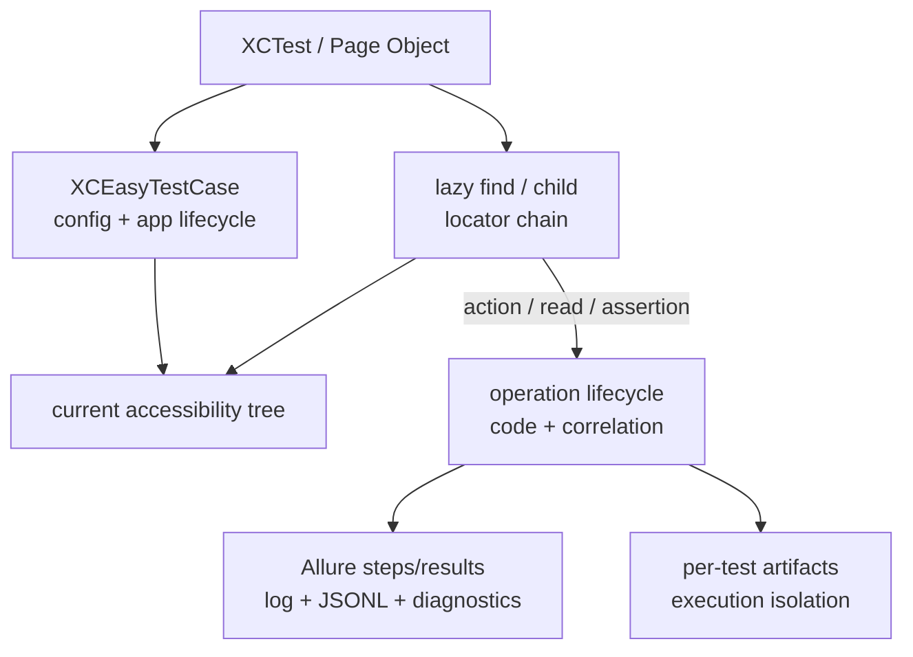

# XCEasy technical guide

English · [Русский](../ru/TECHNICAL_GUIDE_RU.md) · [README](../../README.md)

This document describes the actual architecture and production contract of XCEasy 0.1.1. Feature requirements live in the [specifications](spec/README_EN.md), and accepted decisions live under [`adr/`](adr/).

## 1. Supported environment

| Component | Contract |
|---|---|
| Distribution | Swift Package Manager; Tuist is used only for repository development. |
| Deployment target | iOS 15.0. |
| Package manifest | Swift tools 5.9, Swift 5 language mode. |
| Verified toolchain matrix | Xcode 26.6, Swift 6.3.3, iOS 26.5 simulator runtime. |
| Dependency | Alamofire 5.10.x (`upToNextMajor`). |

Xcode 15/Swift 5.9 is the manifest's technical minimum, but only the matrix in `xceasy.toolchain.json` that passed CI is supported.

## 2. Source layout

```text
XCEasy/Sources/
├── Public/                 public assertions, GWT, deeplink, Device, components
├── TestStructure/          test case, app, context, lazy UI element, observer, logger
├── Configuration/          execution-scoped framework and Allure settings
├── Allure/                 markup, lifecycle models, validation and serialization
├── Execution/              execution identity and correlation contracts
├── Managers/               API and launch configuration
├── Utils/                  diagnostics, events, performance, files and redaction
├── DI/ and Protocols/      injectable runtime boundaries
└── Extensions/
XCEasy/Tests/               framework unit and contract tests
XCEasy/UITests/             framework integration tests
XCEasyIntegrationFixture/   internal UIKit/SwiftUI integration tests
```

The framework remains one product target. Types and protocols enforce boundaries; a new module requires a demonstrated dependency or delivery benefit.

## 3. Runtime architecture



`XCEasyTestContext` owns one test execution. Lock-protected and task-local boundaries preserve context through structured concurrency and prevent parallel tests from mixing configuration, application, steps, logs, or attachments.

## 4. Test lifecycle

1. A built-in XCTest observer registers through framework bootstrap.
2. `testCaseWillStart` creates a stable test ID, unique execution ID, logger, artifact registry, and Allure result.
3. `XCEasyTestCase.setUpWithError` creates execution snapshots of configuration and launch managers.
4. The `Setup` fixture runs `configuration()`, creates `XCUIApplication`, applies arguments/environment, launches the app, and calls `beforeTest()`.
5. The test method runs user and automatic operation steps.
6. An XCTest issue is correlated with the current operation and available screenshot/query artifacts.
7. The `Teardown` fixture calls `afterTest()`, terminates the app, and clears application context.
8. The observer closes open steps and writes the terminal event, Allure result/container, log, diagnostics, and performance summary.
9. Execution-owned state is released independently of neighboring tests.

Do not normally override framework Setup/Teardown. User extension points are `configuration`, `beforeTest`, and `afterTest`.

## 5. UI lookup and actions

`find` and `child` create an immutable lazy locator. Creating a POM or retaining a variable does not read UI state. Every operation and polling attempt resolves the complete parent-child chain against the current accessibility tree.

Lookup supports type, stable identifier, exact text, predicate, and zero-based index. Without an index, multiple matches fail under `.strict`. `.permissive` selects the first match only when explicitly configured and emits warning evidence.

UI action policy:

- `.hittable` is the default: wait for `isHittable` and use semantic XCUI dispatch;
- `.displayed` is a compatibility mode: wait for display and use coordinate dispatch with a warning.

`XCEasyVisibilityPolicy.onScreen` requires frame/viewport intersection. `.nonEmptyFrame` accepts any valid nonempty frame. XCUI cannot prove complete visual occlusion, so the framework does not present that heuristic as an exact state.

## 6. Assertions, steps, and components

Value and UI assertions create a localized Allure step and canonical operation event. Presence, display, hidden, enabled, selected, and hittable are separate contracts. Absence satisfies `assertDoesNotExist`, `assertIsNotDisplayed`, and `assertIsNotHittable`, but not `assertIsHidden`.

`assertDisappears(after:)` and `assertBecomesHidden(after:)` prove a transition by checking initial presence, running the action, and waiting for the terminal state.

`step`, `given`, `when`, `then`, and `and` preserve sync/async nesting. `softly` continues independent assertions and emits one aggregate XCTest failure at scope exit; actions and framework failures remain hard.

`XCEasyComponent` adds an element locator, instance name, and component-aware `step`. `XCEasyIndexedComponent` and `XCEasyComponentCollection` provide lazy first/last/index/range selection and count/empty/all-displayed waits and assertions. Component and collection initialization never reads UI state.

## 7. Allure, logs, and diagnostics

Every test execution creates isolated, uniquely named files:

- `*-result.json` and `*-container.json` for Allure results and fixtures;
- `<testId>_xceasy_log.log` for the redacted human-readable log;
- `<executionId>_events.jsonl` for canonical schema 1.0.0;
- `<executionId>_performance-summary.json` for aggregates and budget findings;
- diagnostic summary, reproduction, manifest, screenshots, and bounded UI snapshots.

A canonical event contains operation code, correlation IDs, source, status, duration, and privacy metadata. UI queries add locator chain, expected/final state, attempts, candidate count, timeline, and reason code. Localized text is not a machine contract.

Text sinks apply the existing targeted credential filter. It does not reliably cover every JSON/header/URL format or anonymize arbitrary values. UI trees, screenshots, and explicit debug output preserve diagnostic detail and may contain application data. Artifact privacy metadata is not proof of complete anonymization. Consumers should use synthetic data and control sharing/retention; blanket UI masking is not the default policy. Attachments record size limits, SHA-256, MIME type, producer, privacy, and truncation metadata.

XCEasy creates `allure-results` only. HTML generation and TestOps upload belong to a separate CLI/CI workflow.

## 8. Host-side boundaries

One XCTest runner writes execution-owned artifacts only. Public orchestration across devices is outside the framework package and belongs to the separately versioned `xceasy-runner` repository. The framework repository contains no coordinator, selection, sharding, recovery, or run-level aggregation implementation.

Healing is evidence-only: runtime never changes locators or source. A provider adapter may return a proposal; application requires a separately authorized host workflow, validation, rollback, and test rerun.

## 9. Performance

Performance level is `.off`, `.basic`, or `.detailed`. Budget policy is `.observe`, `.warn`, or `.fail`; an operation-specific budget overrides the default.

Cross-run comparison requires a compatible environment key covering device, OS, app build, Xcode/toolchain, and execution mode. The framework emits summary/comparison artifacts but does not own permanent history or choose project-specific thresholds.

## 10. Release and compatibility

`release-metadata.json.version` is the single version source. The release contract also includes the matching `CHANGELOG.md` section, `api/XCEasy-<version>.swiftinterface`, toolchain/telemetry metadata, and `v<version>` tag.

`./scripts/check.sh all` is the local CI-parity gate: documentation/contracts, clean SPM build, unit tests, Thread Sanitizer, the internal UIKit/SwiftUI integration fixture, coverage, and release compatibility. Success may be reported only after an actual exit code `0` on the supported matrix.

Public Swift API, telemetry schema, and artifact layout are versioned contracts. A breaking change requires a SemVer/migration decision before merge.

## 11. Known boundaries

- `@ParameterizedTest` expands an inline typed dataset array into separate XCTest methods; external JSON/API datasets are not part of the public contract yet.
- XCUI geometry cannot prove complete visual occlusion; `displayed` means the framework contract, not pixel-level visibility.
- Rich network payload capture is intentionally absent: `ApiManager` logs method, redacted URL, and sizes, not raw headers/body.
- Retention and external AI transfer of diagnostic artifacts belong to user/CI policy.
- Xcode versions outside `xceasy.toolchain.json` are unsupported without CI evidence.

These are explicit contract boundaries, not hidden promises of future behavior. Changes begin with a specification/ADR and testable acceptance criteria.
