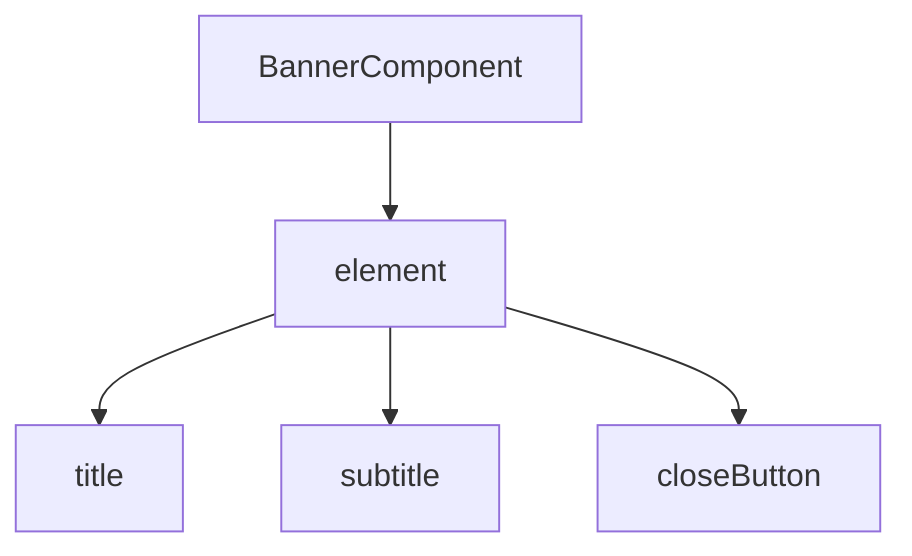

# F12 — Reusable UI components and POM

0.1.1 status: implemented and verified, including indexed collections and component-aware steps.

## Goal

Users model interfaces with reusable component Page Objects. One component must work on multiple screens when given the correct element locator. All child elements, actions, assertions, logs, and self-healing evidence preserve component scope.

## Domain example

A banner is not a set of independent global selectors; it is a component:



One `BannerComponent` can be reused on home, catalog, and profile screens with different element locators and no duplicated POM implementation.

## Implemented baseline

- The sample uses reusable UIKit/SwiftUI component POMs with lazy elements and `element.child(...)` locators.
- Constructing a component or child is side-effect-free. Children strongly retain the immutable parent locator chain, and every poll resolves every segment again without app-scope fallback.
- Diagnostic schema `1.0.0` serializes complete redacted locator chains, symbolic collection selection, bounded query/collection timelines, and explicit query or collection reasons. Real UIKit/SwiftUI tests verify element removal, child absence, current collection counts, and display state.
- The public `XCEasyComponent` protocol supplies an element-only contract, assertions, disappearance transitions, a type-derived or instance-specific `componentName`, and sync/async component-aware `step`. `XCEasyIndexedComponent` declares a common collection locator and lazy position initializer. `XCEasyComponentCollection` supplies lazy first/last/index/range getters plus explicit current-tree count, emptiness, and all-displayed waits/assertions.

## Component contract

- `F12-REQ-001`: a reusable component owns an immutable `element: XCEasyUIElement` or equivalent `XCEasyLocator`.
- `F12-REQ-002`: child locators retain the complete immutable parent locator chain, never a resolved `XCUIElement`.
- `F12-REQ-003`: constructing component, element, and child properties never queries UI or waits for existence.
- `F12-REQ-004`: locator chains are strongly retained as a value/reference graph until observation; resolved snapshots are not cached between operations by default.
- `F12-REQ-005`: a missing parent never causes fallback lookup from the app root.
- `F12-REQ-006`: nested components receive elements through `parent.child(...)` and preserve the complete scope path.
- `F12-REQ-007`: one component type supports element injection, identifier factory, and indexed collection factory without duplicated implementation.
- `F12-REQ-008`: component instances have stable type names and optional semantic instance names for logs/telemetry; identity never depends on memory address.
- `F12-REQ-027`: storing a screen, component, element, or child in a property or local variable stores only immutable locator intent; later semantic use resolves it against the then-current accessibility tree.
- `F12-REQ-028`: a component may outlive screen mutations, removal, and reappearance; every action, assertion, and value read resolves its full element-to-child chain anew.
- `F12-REQ-029`: any optimization that reuses a resolved `XCUIElement`, UI snapshot, or previously observed state across operations violates the component contract, even when telemetry identifies repeated resolution as slow.
- `F12-REQ-030`: the base component protocol has no hidden required-child list; `assertIsDisplayed()` always validates only the element.
- `F12-REQ-031`: when a POM needs composite readiness, it declares a named method such as `assertIsReady()` whose child-state assertions are visible in code.
- `F12-REQ-032`: component `waitForDisplayed(timeout:)`, `waitForHittable(timeout:)`, `waitForEnabled(timeout:)`, and `waitForSelected(timeout:)` delegate non-asserting observation to `element` only and return `Bool`; children are never checked implicitly.
- `F12-REQ-033`: `componentName` defaults to the concrete POM type name for unique components. Indexed components use a stable position-aware default: `First <Type>`, `Last <Type>`, or `<Type> at index N`. A POM may accept and store an initializer argument to distinguish identical instances on one screen.
- `F12-REQ-034`: component-owned `step` uses the same stack, error finalization, and task-propagated lifecycle as the global `step`; it must never flatten nested work into a sibling or top-level step.
- `F12-REQ-035`: canonical step events use `operationCode = component.step`, `target = componentName`, and the immutable `element` selector. Human-readable Allure titles remain `<componentName>: <operation>`.
- `F12-REQ-036`: `XCEasyIndexedComponent` requires `collection` and `init(position:componentName:)`; convenience initializers select `.first` when an index is omitted and supply the framework's position-aware default when an instance name is omitted.
- `F12-REQ-037`: collection construction and first/last/index/range getters create immutable locator intent without reading the UI tree.
- `F12-REQ-038`: `.last` remains symbolic and is recalculated from the current candidate count during every semantic use; an empty collection reports `query.collection_empty` without a negative XCUI index.
- `F12-REQ-039`: an invalid negative requested index never reaches `element(boundBy:)` and reports `query.invalid_index` without trapping.
- `F12-REQ-040`: count, emptiness, and all-displayed waits/assertions sample a fresh current-tree snapshot on every polling attempt.
- `F12-REQ-041`: `assertAllDisplayed` and `waitForAllDisplayed` require a nonempty collection; vacuous success for zero elements is forbidden.
- `F12-REQ-042`: every public collection getter, wait, and assertion creates a localized default Allure step and `ui.collection.started`/`ui.collection.finished` lifecycle.
- `F12-REQ-043`: terminal collection evidence includes a stable operation code, selector, expectation, outcome, attempts, duration, current count, relevant display count/failing indices, context availability, source, and a timeline bounded to 50 observations.
- `F12-REQ-044`: selection evidence is bounded to 100 indices and selection getters never collect UI screenshots or tree snapshots merely to build locator intent.
- `F12-REQ-045`: non-asserting collection waits return `false` on timeout and retain warning-level evidence; assertion variants record an XCTest failure inside their report step.

## Freshness contract

```swift
let banner = screen.promoBanner       // creates a component and locators; no UI query
banner.assertExists()                 // fresh element resolution
banner.closeButton.tap()              // fresh element + child resolution
banner.assertDoesNotExist(timeout: 5) // fresh element resolution after the mutation
```

Reading a POM property is intentionally cheap and side-effect-free. Search begins only when the value is used semantically by an action, assertion, state/value read, or explicit observation API. Each polling attempt is a new observation of the same immutable locator, not a repeated read from a captured element or tree snapshot.

## Component assertions

- `F12-REQ-009`: component `assertExists`/`assertDoesNotExist` target `element`.
- `F12-REQ-010`: element absence is sufficient proof that the complete component is absent.
- `F12-REQ-011`: component `assertIsDisplayed` validates element visibility only; it never checks children implicitly.
- `F12-REQ-012`: child `assertDoesNotExist` passes when an ancestor is absent with reason `query.ancestor_absent`, retaining the full locator path.
- `F12-REQ-013`: child `assertIsHidden` does not pass for an absent ancestor because presence is part of the hidden contract.
- `F12-REQ-014`: component `assertDisappears` observes the element; element removal completes the transition even when descendants become unavailable simultaneously.
- `F12-REQ-015`: element assertions are recommended for component dismissal so a typo in a child selector cannot produce a false success.

## Component actions

- `F12-REQ-016`: public POM actions express semantic intent (`close`, `select`, `fill`) and may return `Self` for chaining.
- `F12-REQ-017`: action steps include component type/instance, element locator path, child target, and source location.
- `F12-REQ-018`: an action expected to remove the element may be linked to a transition assertion as one semantic operation.
- `F12-REQ-019`: components retain no mutable cross-test UI state; instance data is safe for parallel tests.

## Public API

```swift
public protocol XCEasyComponent {
    var element: XCEasyUIElement { get }
    var componentName: String { get }
}

struct BannerComponent: XCEasyComponent {
    let element: XCEasyUIElement
    let componentName: String

    init(element: XCEasyUIElement, componentName: String? = nil) {
        self.element = element
        self.componentName = componentName ?? Self.defaultComponentName
    }

    var title: XCEasyUIElement {
        element.child(identifier: "title")
    }

    var subtitle: XCEasyUIElement {
        element.child(identifier: "subtitle")
    }

    var closeButton: XCEasyUIElement {
        element.child(identifier: "closeButton")
    }

    @discardableResult
    func assertIsReady(timeout: TimeInterval = 5) -> Self {
        element.assertIsDisplayed(timeout: timeout)
        title.assertIsDisplayed(timeout: timeout)
        subtitle.assertIsDisplayed(timeout: timeout)
        closeButton.assertIsHittable(timeout: timeout)
        return self
    }

    @discardableResult
    func closeAndAssertGone(timeout: TimeInterval = 5) -> Self {
        step("Close and check removal") {
            element.assertDisappears(timeout: timeout) {
                closeButton.tap()
            }
        }
        return self
    }
}
```

Reuse across screens:

```swift
var promoBanner: BannerComponent {
    BannerComponent(
        element: find(identifier: "home.promoBanner"),
        componentName: "Home promo banner"
    )
}

var catalogBanner: BannerComponent {
    BannerComponent(
        element: find(identifier: "catalog.content")
            .child(identifier: "promoBanner")
    )
}
```

Indexed components opt into a separate protocol so a unique component is never silently forced to index `0`:

```swift
struct ProductCard: XCEasyIndexedComponent {
    static var collection: XCEasyUIElement {
        find(identifier: "productCard")
    }

    private let position: XCEasyComponentPosition
    let componentName: String

    init(position: XCEasyComponentPosition, componentName: String?) {
        self.position = position
        self.componentName = componentName ?? Self.defaultComponentName(for: position)
    }

    var element: XCEasyUIElement {
        Self.collection.element(at: position, desc: componentName)
    }
}

let cards = XCEasyComponentCollection<ProductCard>()
cards.assertCount(3).assertAllDisplayed()
cards.first.assertExists()
cards.get(index: 2, componentName: "Recommended product").assertIsDisplayed()
cards.last.assertExists()
```

## Observation and reason codes

Child-locator observations additionally contain:

- component operation code and instance `target`;
- full element-to-child selector in `selector`;
- `failed_segment_index`;
- `ancestor_state`;
- reason `query.ancestor_absent`, `query.ancestor_ambiguous`, `query.element_absent`, `query.child_hidden`, or `query.child_present`.

`query.ancestor_absent` is a valid success reason for `assertDoesNotExist` but must not be lost in a generic “child not found” message.

## Self-healing

- `F12-REQ-020`: healing searches for replacements inside the original component element, not the entire app tree.
- `F12-REQ-021`: when an element changes, the engine first proposes an element mapping and then reevaluates descendants.
- `F12-REQ-022`: identical children in different component instances never mix in candidate ranking.
- `F12-REQ-023`: a shared component POM change lists every potentially affected screen/test.

## Performance telemetry

- `F12-REQ-024`: spans retain component/element/child paths and measure each segment resolution separately.
- `F12-REQ-025`: repeated element resolution appears as a finding, but caching is proposed only after staleness analysis.
- `F12-REQ-026`: component-level actions/assertions are parent spans for their internal UI operations.

## Compatibility

Components use `element.child(...)` and retain an immutable locator chain; resolved UI elements are never stored as component parents. The removal of beta `root` and `componentStep` names is intentional and documented in the component API migration guide.

The unpublished closure initializer, optional subscript, `component(at:)`, and `prefix(_:)` collection APIs are removed rather than deprecated. Consumers declare `XCEasyIndexedComponent.collection`, initialize `XCEasyComponentCollection<Component>()`, and use `first`, `last`, `get(index:)`, `get(indices:)`, or explicit collection state operations.

## Acceptance criteria

- Reading `banner.title` performs no query and waits for no timeout.
- Two banner instances with identical child identifiers resolve only inside their own elements.
- A removed element causes no global fallback and correctly passes component `assertDoesNotExist`.
- A child negative assertion under a removed element passes with reason `query.ancestor_absent`.
- A child positive assertion under a removed element fails with locator path and failed ancestor segment.
- One shared component POM works under elements on two screens without copied code.
- Nested components at least three levels deep preserve scope, telemetry, and attachment ownership.
- Parallel tests using identical component types never mix observations.
- A component created before its element appears can later find it without rebuilding the component.
- The same stored component observes removal and reappearance of its element and never returns cached state.
- A child operation after a screen mutation resolves every parent segment again and cannot use a stale parent handle.
- `banner.assertIsDisplayed()` validates only the element; component waits observe the element without an XCTest failure, while `banner.closeButton.tap()` waits for its effective action state itself.
- Composite readiness has an explicit domain name and lists child assertions in the POM.
- A global step containing a component step, nested component steps, and their inner assertion/action retains the exact Allure hierarchy in sync and async tests.
- Throwing from a component step marks its hierarchy failed, restores the parent stack, and leaves the next step at the correct level.
- Two identical components with different initializer names have different human-readable step targets while keeping locator evidence structured.
- Retained `first` and `last` components resolve against the current collection after insertion or deletion without cached indices.
- Exact/lower/upper count, empty/nonempty, and all-displayed wait/assertion variants have deterministic unit coverage and real SwiftUI sample coverage.
- Every collection operation has a localized step and schema-1.0.0 terminal evidence suitable for reconstructing expected and observed state.

## Decisions and remaining questions

- `F12-DEC-001`: `XCEasyComponent` is a public framework protocol with default element assertions and a component-aware overload of the ordinary `step` name.
- `F12-DEC-002`: the hidden required-child descriptor decision was superseded on August 10, 2026 before production release. `XCEasyComponentRequirement`, `XCEasyRequiredChildState`, `requiredChildren`, and `assertRequiredChildren()` are removed; component assertions have element-only semantics and composite readiness uses a named POM method.
- `F12-DEC-003`: superseded by ADR-0015. `XCEasyComponentCollection` keeps selection metadata side-effect-free while exposing explicit UI-reading methods whose names (`assertCount`, `waitForCount`, `assertAllDisplayed`) make query timing visible.
- `F12-DEC-004`: public beta names `root` and `componentStep` are removed rather than deprecated. `element` avoids confusion with the accessibility-tree root, and one `step` name avoids a parallel lifecycle API.
- `F12-DEC-005`: `XCEasyIndexedComponent` owns the optional default-index convenience. The base component protocol does not imply indexing.
- `F12-DEC-006`: ADR-0016 replaces beta `container`/`collectionContainer` names with `element`/`collection`; Allure result containers and canonical selector fields are unchanged.
