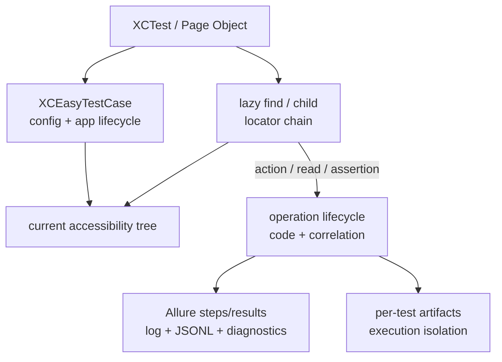

# XCEasy: техническое руководство

Русский · [English](../en/TECHNICAL_GUIDE_EN.md) · [README](../../README_RU.md)

Документ описывает фактическую архитектуру и production-контракт XCEasy 0.1.3. Требования по отдельным возможностям находятся в [спецификациях](spec/README_RU.md), принятые решения — в [`adr/`](adr/).

## 1. Поддерживаемая среда

| Компонент | Контракт |
|---|---|
| Distribution | Swift Package Manager; Tuist используется только для разработки репозитория. |
| Deployment target | iOS 15.0. |
| Package manifest | Swift tools 5.9, Swift 5 language mode. |
| Проверенная toolchain matrix | Xcode 26.6, Swift 6.3.3, simulator runtime iOS 26.5. |
| Зависимость | Alamofire 5.12.0 (`exact`). |

Xcode 15/Swift 5.9 является техническим минимумом manifest, но поддержанной считается только matrix из `xceasy.toolchain.json`, прошедшая CI.

## 2. Структура исходного кода

```text
XCEasy/Sources/
├── Public/                 public assertions, GWT, deeplink, Device, components
├── TestStructure/          test case, app, context, lazy UI element, observer, logger
├── Configuration/          execution-scoped framework and Allure settings
├── Allure/                 markup, lifecycle models, validation and serialization
├── Execution/              execution identity и correlation contracts
├── Managers/               API and launch configuration
├── Utils/                  diagnostics, events, performance, files and redaction
├── DI/ and Protocols/      injectable runtime boundaries
└── Extensions/
XCEasy/Tests/               framework unit and contract tests
XCEasy/UITests/             framework integration tests
XCEasyIntegrationFixture/   внутренние UIKit/SwiftUI integration tests
```

Framework остаётся одним product target. Границы поддерживаются типами и протоколами; добавлять отдельный module можно только при доказанном выигрыше в зависимости или delivery.

## 3. Runtime architecture



`XCEasyTestContext` владеет состоянием конкретного test execution. Lock-protected и task-local границы сохраняют context при structured concurrency и не позволяют параллельным тестам смешивать config, application, steps, logs и attachments.

## 4. Жизненный цикл теста

1. Встроенный XCTest observer регистрируется bootstrap-механизмом framework.
2. `testCaseWillStart` создаёт stable test ID, unique execution ID, logger, artifact registry и Allure result.
3. `XCEasyTestCase.setUpWithError` создаёт execution snapshots конфигурации и launch managers.
4. Fixture `Setup` выполняет `configuration()`, создаёт `XCUIApplication`, применяет arguments/environment, запускает app и вызывает `beforeTest()`.
5. Test method выполняет пользовательские и автоматические operation steps.
6. XCTest issue связывается с текущей операцией и доступными screenshot/query artifacts.
7. Fixture `Teardown` вызывает `afterTest()`, закрывает app и очищает application context.
8. Observer закрывает незавершённые steps, пишет terminal event, Allure result/container, log, diagnostics и performance summary.
9. Execution-owned state освобождается независимо от соседних тестов.

Setup/Teardown framework не следует переопределять напрямую: пользовательскими extension points являются `configuration`, `beforeTest` и `afterTest`.

## 5. UI lookup и действия

`find` и `child` создают immutable lazy locator. Создание POM или сохранение переменной не читает UI. Каждая операция и каждая polling attempt заново разрешает всю parent-child chain по текущему accessibility tree.

Поиск поддерживает type, stable identifier, exact text, predicate и zero-based index. Без index несколько matches обрабатываются `.strict` failure. `.permissive` выбирает первый match только при явной конфигурации и пишет warning evidence.

UI action policy:

- `.hittable` — default: ожидание `isHittable` и semantic XCUI dispatch;
- `.displayed` — compatibility mode: ожидание display и coordinate dispatch с warning.

Visibility определяется `XCEasyVisibilityPolicy`: `.onScreen` требует пересечения frame с viewport, `.nonEmptyFrame` принимает любой valid непустой frame. XCUI не позволяет доказать полное visual occlusion, поэтому framework не выдаёт такую эвристику за точное состояние.

## 6. Assertions, steps и components

Value assertions и UI assertions создают локализованный Allure step и canonical operation event. Presence, display, hidden, enabled, selected и hittable являются разными контрактами. Отсутствие корректно для `assertDoesNotExist`, `assertIsNotDisplayed` и `assertIsNotHittable`, но не для `assertIsHidden`.

`assertDisappears(after:)` и `assertBecomesHidden(after:)` доказывают переход: сначала проверяют начальное presence, затем выполняют action и ждут конечное состояние.

`step`, `given`, `when`, `then` и `and` сохраняют вложенность sync/async операций. `softly` продолжает независимые assertions и в конце создаёт один aggregate XCTest failure; actions и framework failures остаются hard.

`XCEasyComponent` добавляет element locator, instance name и component-aware `step`. `XCEasyIndexedComponent` и `XCEasyComponentCollection` дают lazy first/last/index/range selection, count/empty/all-displayed waits и assertions. Инициализация components и collections не обращается к UI.

## 7. Allure, логи и diagnostics

Каждый test execution создаёт отдельные файлы с уникальными именами:

- `*-result.json` и `*-container.json` — Allure result и fixtures;
- `<testId>_xceasy_log.log` — redacted человекочитаемый лог;
- `<executionId>_events.jsonl` — canonical schema 1.0.0;
- `<executionId>_performance-summary.json` — агрегаты и budget findings;
- diagnostic summary, reproduction, manifest, screenshots и bounded UI snapshots.

Canonical event содержит operation code, correlation IDs, source, status, duration и privacy metadata. UI query дополнительно хранит locator chain, expected/final state, attempts, candidate count, timeline и reason code. Локализованный текст не является машинным контрактом.

Текстовые sinks используют существующий точечный фильтр учётных данных. Он не покрывает надёжно все форматы JSON/headers/URL и не обезличивает произвольные значения. Дерево UI, скриншоты и явный debug output сохраняют диагностические детали и могут содержать данные приложения. Privacy metadata артефакта не доказывает полное обезличивание. Используйте синтетические данные и управляйте доступом/хранением; тотальное маскирование UI не является политикой по умолчанию. Attachments имеют size limit, SHA-256, MIME type, producer, privacy и truncation metadata.

XCEasy создаёт только `allure-results`. HTML и upload в TestOps выполняются отдельным CLI/CI workflow.

## 8. Границы host-side tooling

Runtime одного XCTest runner пишет только execution-owned artifacts. Public orchestration на нескольких devices не входит в framework package и принадлежит отдельно версионируемому репозиторию `xceasy-runner`. В framework repository нет coordinator, selection, sharding, recovery или run-level aggregation implementation.

Healing является evidence-only: runtime не меняет locator и source. Provider adapter может вернуть proposal; применение требует отдельного разрешённого host workflow, validation, rollback и повторного запуска тестов.

## 9. Performance

Performance level принимает `.off`, `.basic`, `.detailed`. Budget policy принимает `.observe`, `.warn`, `.fail`; operation-specific budget имеет приоритет над default.

Сравнение прогонов допустимо только для совместимого environment key: device, OS, app build, Xcode/toolchain и execution mode. Framework создаёт summary и comparison artifacts, но не владеет бессрочной историей и не выбирает project-specific threshold за пользователя.

## 10. Release и compatibility

`release-metadata.json.version` — единый источник версии. Release contract также включает соответствующий раздел `CHANGELOG.md`, `api/XCEasy-<version>.swiftinterface`, toolchain/telemetry metadata и tag `v<version>`.

`./scripts/check.sh all` является локальным CI-parity gate: documentation/contracts, clean SPM build, unit tests, Thread Sanitizer, внутренний UIKit/SwiftUI integration fixture, coverage и release compatibility. Успех можно заявлять только после фактического exit code `0` на поддержанной matrix.

Public Swift API, telemetry schema и artifact layout являются versioned contracts. Breaking change требует SemVer/migration решения до merge.

## 11. Известные границы

- `@ParameterizedTest` превращает inline-массив типизированных datasets в отдельные XCTest methods; внешние JSON/API datasets пока не входят в public contract.
- Полное visual occlusion недоступно через XCUI geometry; `displayed` означает контракт framework, а не pixel-level видимость.
- Rich network payload capture намеренно отсутствует: `ApiManager` пишет method, redacted URL и размеры, но не raw headers/body.
- Retention и отправка diagnostic artifacts во внешнюю AI-систему принадлежат политике пользователя/CI.
- Xcode versions вне `xceasy.toolchain.json` не считаются поддержанными без CI evidence.

Это ограничения контракта, а не скрытые обещания будущего поведения. Их изменение начинается со спецификации/ADR и проверяемых acceptance criteria.
