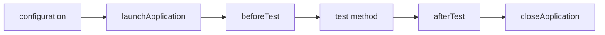

# Жизненный цикл теста и приложения

Русский · [English](../../en/guide/02_LIFECYCLE_EN.md) · [Оглавление](../PRODUCT_GUIDE_RU.md) · [Краткий README](../../../README_RU.md)


Наследуйтесь от `XCEasyTestCase`, чтобы каждый test method получил отдельную конфигурацию, приложение, Allure result, log и artifacts. Фреймворк выполняет этапы в таком порядке:



| Hook/метод | Когда вызывается | Что в нём размещать |
|---|---|---|
| `configuration()` | Перед запуском приложения в каждом тесте. | `XCEasyConfig`, `XCEasyAllureConfig`, launch arguments/environment. В конце вызывайте `super.configuration()`, чтобы настройки попали в log. |
| `beforeTest()` | После запуска приложения, перед test method. | Общие preconditions и Allure metadata для каждого теста класса. Вызовите `super.beforeTest()`. |
| `afterTest()` | После test method, перед закрытием приложения. | Пользовательскую очистку, которая должна выполниться пока приложение ещё доступно. Вызовите `super.afterTest()`. |
| `launchApplication()` | Автоматически в setup; можно вызвать вручную после `closeApplication()`. | Запуск текущего `XCUIApplication` с настроенными arguments/environment. |
| `closeApplication()` | Автоматически в teardown. | Явное завершение приложения внутри сценария. |
| `reopenApplication()` | Только по вызову пользователя. | Полный terminate + launch, например для проверки сохранённой сессии. |
| `printDebugTree()` | Только по вызову пользователя. | Локальная печать всего текущего accessibility tree. |

```swift
final class SessionTests: BaseTestCase {
    override func beforeTest() {
        feature("Session")
        super.beforeTest()
    }

    func testSessionSurvivesRestart() {
        find(identifier: "loginButton").tap()
        find(identifier: "homeScreen").assertIsDisplayed()

        reopenApplication()

        find(identifier: "homeScreen").assertIsDisplayed()
    }
}
```

Не переопределяйте `setUpWithError()`/`tearDownWithError()` без необходимости: в них XCEasy создаёт и освобождает execution-scoped state. Для обычных пользовательских действий предназначены hooks выше.

## Примеры всех public hooks и методов

```swift
class BaseTestCase: XCEasyTestCase {
    override func configuration() {
        XCEasyConfig.apply(localization: .ru)
        LaunchArgumentsManager.add("-ui_testing")
        super.configuration()
    }

    override func beforeTest() {
        feature("Каталог")
        find(identifier: "homeScreen").assertIsDisplayed()
        super.beforeTest()
    }

    override func afterTest() {
        find(identifier: "debugMenu.close").tap()
        super.afterTest()
    }
}

final class ApplicationLifecycleTests: BaseTestCase {
    func testManualLifecycleOperations() {
        closeApplication()
        launchApplication()
        find(identifier: "rememberMe").tap()
        reopenApplication()
        printDebugTree()
        find(identifier: "homeScreen").assertIsDisplayed()
    }
}
```

`configuration`, `beforeTest` и `afterTest` вызываются для каждого test method. Для полного рестарта используйте `reopenApplication()`. Отдельная пара `closeApplication()`/`launchApplication()` нужна, когда между вызовами меняются launch settings.

## Что будет в отчёте

```text
Setup
  Test Configuration
  Launch application                 app.launch
  Before Test
testManualLifecycleOperations
  Close application                  app.terminate
  Launch application                 app.launch
  Reopen application                 app.reopen
    Close application                app.terminate
    Launch application               app.launch
Teardown
  After Test
  Close application                  app.terminate
```

`printDebugTree()` печатает дерево только в консоль и не создаёт assertion.
